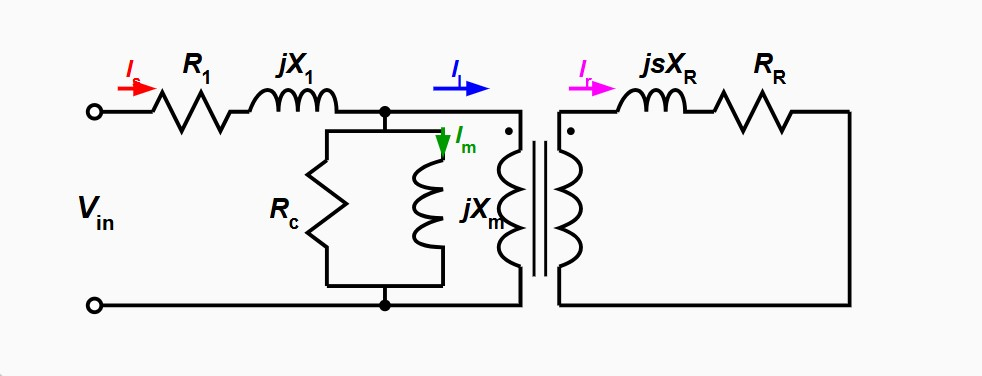
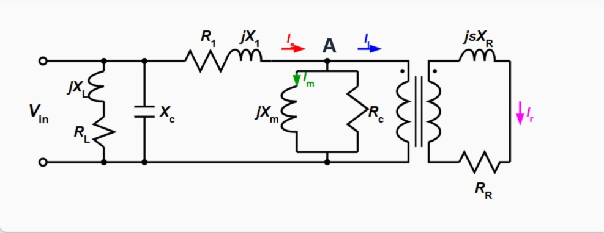

This document explains the mathematical and physical logic behind the induction machine simulation provided in the `sketch.js` file. It breaks down how currents, magnetic fields, operating frequency, and magnetizing reactance are calculated for both grid-connected (motor) and standalone (generator) modes.

---

## 1. How Currents are Calculated

### a. Grid-Connected Motor / Generator
In grid-connected mode, the simulation models the motor using the standard per-phase equivalent circuit of an induction machine. A fixed voltage (`Vin`) and grid frequency are applied. 

The process is as follows:
1. **Define Impedances:**
   * Rotor Impedance: $Z_{R2,X2} = \frac{R_2}{s} + jX_2$ (where $s$ is slip)
   * Core/Magnetizing Branch: Formed by $Z_{Rc} = R_c$ and $Z_{Xm} = jX_m$ in parallel.
   * Stator Impedance: $Z_{R1,X1} = R_1 + jX_1$.
2. **Current Calculation:**
   * **Stator Current ($I_s$):** Calculated using Ohm's law: $I_s = \frac{V_{in}}{Z_{eq}}$.
   * **Magnetization Current ($I_m$):** The voltage across the air gap ($V_{gap}$) is found by dividing the stator current by the equivalent parallel admittance. Then, $I_m = \frac{V_{gap}}{Z_{Xm}}$.
   * **Rotor Current ($I_r$):** Similarly, the load/rotor current reflected to stator side is $I_r = \frac{V_{gap}}{Z_{R2,X2}}$.

### b. Standalone Generator
In standalone mode, the machine operates as a self-excited induction generator (SEIG). There is no external voltage source; excitation is provided by a capacitor bank, and the machine builds up voltage from residual magnetism.

The process of calculating the currents are as follows:
1. **Frequency Scaling:** All reactive components ($X_1, X_2, X_c, X_L, X_m$) are scaled by the operating frequency ratio: $\frac{f}{f_{base}}$ (Finding the frequency of stator circuit is discussed later).
2. **Current Phases/Magnitudes:**
   * **Stator Current ($I_s$):** Represented by the inverse of the stator Thevenin impedance, factoring in the load and excitation capacitors: $I_s = -(Z_{R1,X1} + (Y_{load} + Y_{exc})^{-1})^{-1}$.
   * **Magnetization Current ($I_m$):** Represented by the admittance of the magnetizing branch $I_m = \frac{1}{jX_m}$.
   * **Rotor Current ($I_r$):** Represented by the admittance of the rotor branch $I_r = (\frac{R_2}{s} + jX_2)^{-1}$.
  
   The exact voltage across air gap is not possible to determine without the magnetization curve, so we used the value 1 for voltage across air gap. It does not give exact magnitude of current, but thier values remain proportional to their exact value and phases are calculated correctly. After all, we need currents for calculating the magnetic field and the magnitude of magnetic field is proportional to the current, so we do no need exact value. Relative values with correct phase angle is enough for drawing the fields at correct angle with each other and correct relative strength.
---

## 2. Magnetic Field Calculations

The visualization maps the computed electrical currents to spatial magnetic field vectors.

### a. Stator Magnetic Field
The stator magnetic field is generated by the 3-phase windings, spatially offset by 120° ($\frac{2\pi}{3}$ radians).
* The simulation iterates over the 3 phases (A, B, C).
* For each phase, it calculates the instantaneous current value from the phasor calculated earlier.
* The magnetic field contribution of each phase is a vector directed perpendicular to the physical coil orientation in a direction determined by right hand rule, with a magnitude proportional to the instantaneous current.
* The total **Stator Field ($B_s$)** (as well as Magnetizing Field $B_m$ and Load Field $B_l$) is the vector sum of these 3 spatial contributions.

### b. Rotor Magnetic Field
The rotor is modeled as a squirrel cage with a discrete number of bars (`numRotorBars`).
* The rotor physically rotates at an angle determined by $\omega \cdot t \cdot (1 - s)$.
* The electrical frequency of the induced voltage and currents in the rotor is the slip frequency: $\omega_r = \omega \cdot s$ becuase of relative speed.
* The induced current in each bar is produced due to the induced voltage which is created due to relative motion of the magnetization magnetic field and the rotor bars. At t=0, the velocity vector of the bars are at different angle with the magnetization magnetic field. That angles act as initial phase shift for induced voltage in different bar. 
* Current lags the voltage by  rotor power factor angle $\theta_{pf} = \arctan(\frac{sX_2}{R_2})$ .
* Each bar creates a magnetic field vector perpendicular to its position in a direction determined by the right hand rule, with strength proportional to the magnitude of the current.
* The total **Rotor Field ($B_r$)** is the vector sum of the magnetic fields produced by all individual rotor bars.

---
## 3. Frequency Calculation for Standalone Generator Mode

The operating frequency ($f$) in standalone mode is not fixed by a grid; it is determined by the real power balance of the system. The mechanical power provided by the prime mover (at speed corresponding to $f_i$) must balance the electrical losses and the load.

To find the the equation we can solve to find the frequency, we use the fact that the sum of currents entering and exiting node A, in generator circuit drawn above, must be zero. If the voltage of node A is $V$, then $V \sum Y = 0$ where $Y$ are the impedances of the branches connected to node A. So we can say $\sum Y = 0$ and so $Re(Y) = 0$

The `solveForF` function determines this frequency using the **Bisection Method**:
1. **Objective:** Find the frequency $f$ where the **real part of the total admittance**  $Re(Y)$  is exactly zero. 
2. **Evaluation Function (`evaluateRealAdmittance`):** For a given test frequency $f$, it scales all reactances, calculates the slip $s = \frac{f - f_i}{f}$, and determines the real conductance of the entire equivalent circuit (rotor, core, stator, load).
3. **Bisection Search:**
   * It sets a lower bound (`0.05` Hz) and an upper bound just below the prime mover frequency (`fi - 1e-6`).
   * It repeatedly halves the interval (up to 40 iterations), checking whether the zero-crossing of the real admittance lies in the lower or upper half.
   * It narrows down on the exact frequency $f$ where $Re(Y) = 0$ and returns it. If the function cannot find a zero-crossing, it returns `null`, indicating that the generator failed to self-excite.
  
## 4. $X_m$ Calculation for Standalone Generator Mode

Just like solving $Re(Y) = 0$ we got the frequency, solving $Im(Y) = 0$ gives us the required value of Xm for overall balance.

The `solveForXm` function calculates this required saturated value:
1. It scales all impedances based on the calculated operating frequency $f$.
2. It calculates the **imaginary part of the total admittance** $Im(Y)$ of the entire circuit *excluding* the magnetizing branch. Total admittance is equal to the sum of admittance of rotor branch, magnetizing branch and stator branch. Stator branch contains $R_1, jX_1,$ in series with the parallel combination of $-jX_c$ and $R_L + jX_L$ 
3. For the circuit to be in resonance (reactive power balance), the total imaginary admittance must be zero. Therefore, the imaginary admittance of the magnetizing branch must perfectly cancel out the rest of the circuit.
4. It sets $X_m$ such that $\frac{-1}{X_m} = - (Y_{stator\_side\_imag} + Y_{rotor\_imag})$, resulting in the code's formula: 
   $$X_m = \frac{1}{Y_{stator\_side\_imag} + Y_{rotor\_imag}}$$

This value of Xm can be used to find the voltage of node A and hence the generated voltage also. In the magnetization curve of the generator with voltage on y axis and current on x axis, the of node A is the voltage of the point where the slope is equal to the Xm. The graph must be drawn using data collected at the frequency found out earlier.

